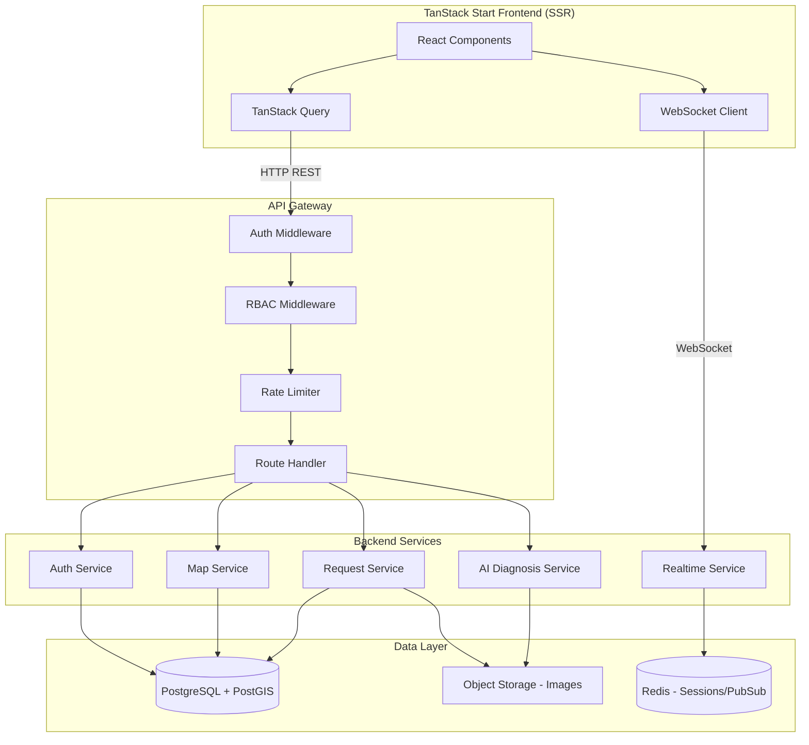
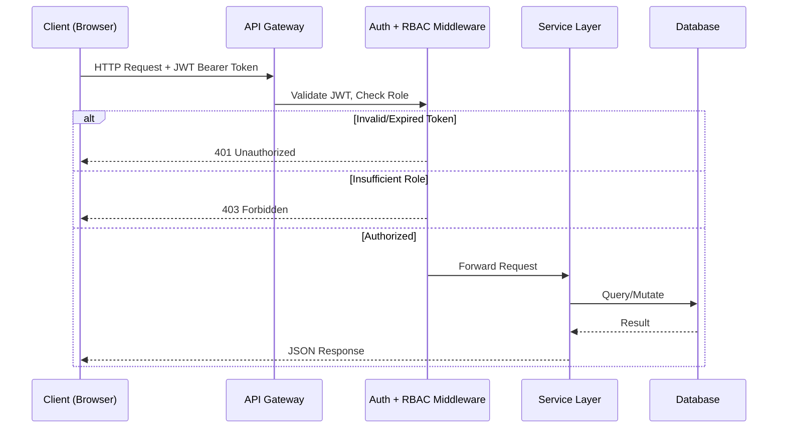
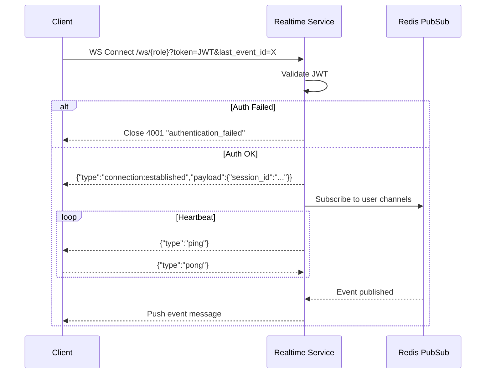

# Design Document: Backend API Contracts

## Overview

This design defines the backend API contracts for the FixIt on-demand technician marketplace. The system exposes a RESTful HTTP API and WebSocket real-time channels consumed by a TanStack Start (SSR) frontend with React 19 and React-Leaflet. Three user roles (Client, Technician, Admin) interact with distinct endpoint sets, all protected by JWT-based authentication and role-based access control.

The API layer is designed as a contract specification — defining request/response schemas, authentication flows, real-time message protocols, and error handling conventions — enabling independent backend implementation while guaranteeing frontend compatibility.

### Key Design Decisions

1. **REST + WebSocket hybrid**: REST for CRUD operations and data fetching; WebSocket for real-time flows (radar search, location tracking, mission alerts, admin events)
2. **JWT stateless auth**: Short-lived access tokens with role claims enable horizontal scaling without session stores
3. **Role-scoped WebSocket paths**: `/ws/client`, `/ws/technician`, `/ws/admin` simplify routing and authorization
4. **Geospatial filtering at the API level**: All map endpoints accept `lat`, `lng`, `radius_km` to push spatial queries to the backend
5. **Pagination convention**: Cursor-less offset pagination (`page`/`per_page`) for admin tables; unbounded arrays for map markers (bounded by radius)

## Architecture



### Request Flow



### WebSocket Connection Flow



## Components and Interfaces

### 1. Auth Service

| Endpoint | Method | Auth | Description |
|----------|--------|------|-------------|
| `/api/auth/login` | POST | None | Authenticate user, return JWT + user object |
| `/api/auth/me` | GET | JWT | Return current user session data |

### 2. Map Service

| Endpoint | Method | Auth | Description |
|----------|--------|------|-------------|
| `/api/map/requests` | GET | Client | Get service request markers within radius |
| `/api/map/technicians` | GET | Client, Admin | Get technician markers within radius |
| `/api/map/heatmap` | GET | Technician, Admin | Get demand heatmap zones |

### 3. Request Service

| Endpoint | Method | Auth | Description |
|----------|--------|------|-------------|
| `/api/requests` | POST | Client | Create a new service request |
| `/api/requests/mine` | GET | Client | Get client's request history |
| `/api/jobs/available` | GET | Technician | Get available jobs near technician |
| `/api/jobs/completed` | GET | Technician | Get technician's completed jobs |

### 4. Technician Service

| Endpoint | Method | Auth | Description |
|----------|--------|------|-------------|
| `/api/technician/availability` | PATCH | Technician | Toggle online/offline status |

### 5. Admin Service

| Endpoint | Method | Auth | Description |
|----------|--------|------|-------------|
| `/api/admin/transactions` | GET | Admin | List transactions with pagination |
| `/api/admin/transactions/summary` | GET | Admin | Get today's transaction summary |
| `/api/admin/verifications` | GET | Admin | List technician verifications |
| `/api/admin/verifications/:id` | PATCH | Admin | Approve/reject a verification |
| `/api/admin/events` | GET | Admin | Get recent platform events |
| `/api/admin/kpis` | GET | Admin | Get KPI dashboard metrics |
| `/api/admin/performance/weekly` | GET | Admin | Get weekly performance data |

### 6. AI Service

| Endpoint | Method | Auth | Description |
|----------|--------|------|-------------|
| `/api/ai/diagnose` | POST | Client | Upload photo for AI diagnosis |

### 7. Realtime Service (WebSocket)

| Channel | Roles | Messages |
|---------|-------|----------|
| `/ws/client` | Client | `search:ack`, `search:progress`, `search:match`, `search:timeout`, `tracking:update`, `tracking:arrived` |
| `/ws/technician` | Technician | `mission:offer`, `mission:confirmed`, `mission:expired` |
| `/ws/admin` | Admin | Event stream (same structure as REST events) |

#### Client → Server Messages

| Type | Payload | Description |
|------|---------|-------------|
| `search:start` | `{ lat, lng, category, request_id }` | Initiate radar search |
| `mission:accept` | `{ mission_id }` | Accept a mission offer |
| `mission:reject` | `{ mission_id }` | Reject a mission offer |
| `pong` | (empty) | Heartbeat response |

#### Server → Client Messages

| Type | Payload | Description |
|------|---------|-------------|
| `connection:established` | `{ session_id }` | Connection confirmed |
| `search:ack` | `{ search_id }` | Search initiated |
| `search:progress` | `{ technicians_found, radius_km, elapsed_seconds }` | Search progress |
| `search:match` | `{ technician: {...} }` | Technician matched |
| `search:timeout` | `{ message }` | No match found in 30s |
| `tracking:update` | `{ technician_id, position, eta_minutes, progress_percent, status }` | Location update |
| `tracking:arrived` | `{ technician_id, arrived_at }` | Technician arrived |
| `mission:offer` | `{ mission_id, title, category, urgent, payout, distance_km, expires_in_seconds, client_location }` | Job offer |
| `mission:confirmed` | `{ mission_id, client_name, client_address, navigation_url }` | Mission accepted |
| `mission:expired` | `{ mission_id }` | Mission expired/rejected |
| `ping` | (empty) | Heartbeat check |


## Data Models

### Authentication

```typescript
// POST /api/auth/login - Request
interface LoginRequest {
  email: string;
  password: string;
}

// POST /api/auth/login - Response (200)
interface LoginResponse {
  token: string;
  user: UserObject;
  expires_at: string; // ISO-8601
}

// GET /api/auth/me - Response (200)
interface SessionResponse {
  user: UserObject;
}

interface UserObject {
  id: string;
  name: string;
  email: string;
  role: "client" | "technician" | "admin";
  avatar_url: string;
}

// JWT Payload
interface JWTPayload {
  sub: string;   // user ID
  role: "client" | "technician" | "admin";
  iat: number;   // issued-at Unix timestamp
  exp: number;   // expiration Unix timestamp
}
```

### Map Data

```typescript
// GET /api/map/requests - Response
type RequestMarkersResponse = RequestMarker[];

interface RequestMarker {
  id: string;
  position: [number, number]; // [latitude, longitude]
  label: string;
  type: "request";
  category: "Electricidad" | "Plomería" | "Climatización" | "General" | "Cerrajería";
}

// GET /api/map/technicians - Response
type TechnicianMarkersResponse = TechnicianMarker[];

interface TechnicianMarker {
  id: string;
  position: [number, number]; // [latitude, longitude]
  label: string; // "Name - Specialty"
  type: "technician";
  status: "available" | "en_route" | "busy";
}

// GET /api/map/heatmap - Response
type HeatmapResponse = HeatmapZone[];

interface HeatmapZone {
  id: string;
  center: [number, number]; // [latitude, longitude]
  radius_m: number;
  intensity: number; // 0.0 - 1.0
  label: string;
}

// Query parameters for all map endpoints
interface MapQueryParams {
  lat: number;
  lng: number;
  radius_km: number;
  all?: "true"; // Admin-only for technicians endpoint
}
```

### Service Requests

```typescript
// POST /api/requests - Request
interface CreateRequestBody {
  title: string;        // 5-200 chars
  category: "electrical" | "plumbing" | "hvac" | "general" | "locksmith" | "cleaning";
  description: string;  // 0-2000 chars
  location: {
    lat: number;
    lng: number;
    address: string;
  };
  images: string[];     // max 4 URLs
}

// POST /api/requests - Response (201)
interface CreateRequestResponse {
  id: string;
  title: string;
  category: string;
  description: string;
  location: { lat: number; lng: number; address: string };
  images: string[];
  status: "pending";
  created_at: string; // ISO-8601
  nearby_technicians_count: number;
  estimated_response_min: number;
}

// GET /api/requests/mine - Response
type ClientRequestsResponse = ClientRequest[];

interface ClientRequest {
  id: string;
  title: string;
  category: string;
  status: "active" | "completed" | "cancelled";
  technician: { name: string } | null;
  created_at: string; // ISO-8601
  price: string | null;
  eta_minutes?: number | null; // only when status is "active"
}
```

### Jobs (Technician)

```typescript
// GET /api/jobs/available - Response
type AvailableJobsResponse = AvailableJob[];

interface AvailableJob {
  id: string;
  category: string;
  title: string;
  distance_km: number; // one decimal
  expires_in_min: number;
  payout: string; // "$min–max"
  urgent: boolean;
}

// GET /api/jobs/completed - Response
type CompletedJobsResponse = CompletedJob[];

interface CompletedJob {
  id: string;
  title: string;
  earnings: string; // "$amount"
  rating: number;   // 1-5
  completed_at: string; // ISO-8601
}
```

### Admin Data

```typescript
// GET /api/admin/transactions - Response
interface TransactionsResponse {
  data: Transaction[];
  total: number;
  page: number;
  per_page: number;
}

interface Transaction {
  id: string;
  client: string;
  technician: string;
  service: string;
  amount: string;     // "$X.XX"
  commission: string; // "$X.XX"
  status: "completed" | "in_progress" | "disputed";
  created_at: string; // ISO-8601
}

// GET /api/admin/transactions/summary - Response
interface TransactionSummary {
  today_count: number;
  today_volume: string;     // "$X,XXX"
  today_commission: string; // "$XX.XX"
  disputes_pending: number;
}

// GET /api/admin/verifications - Response
type VerificationsResponse = Verification[];

interface Verification {
  id: string;
  name: string;
  specialty: string;
  experience: string;
  documents_count: number;
  submitted_at: string; // ISO-8601
}

// PATCH /api/admin/verifications/:id - Request
interface VerificationAction {
  action: "approve" | "reject";
  reason?: string; // required when action is "reject"
}

// GET /api/admin/events - Response
type EventsResponse = PlatformEvent[];

interface PlatformEvent {
  id: string;
  time: string; // ISO-8601
  type: "info" | "success" | "warning" | "error";
  message: string;
}

// GET /api/admin/kpis - Response
interface KPIResponse {
  active_services: KPIMetric;
  technicians_online: KPIMetric;
  revenue_today: KPIMetric;
  reports_pending: KPIMetric;
}

interface KPIMetric {
  value: number | string;
  delta: string; // "+12%" or "-3"
}

// GET /api/admin/performance/weekly - Response
interface WeeklyPerformance {
  days: WeekDay[];
}

interface WeekDay {
  label: string;     // day name
  completed: number;
  date: string;      // ISO-8601 date
}
```

### Technician Availability

```typescript
// PATCH /api/technician/availability - Request
interface AvailabilityRequest {
  online: boolean;
  lat: number;
  lng: number;
}

// PATCH /api/technician/availability - Response (200)
interface AvailabilityResponse {
  online: boolean;
  updated_at: string; // ISO-8601
}
```

### AI Diagnosis

```typescript
// POST /api/ai/diagnose - Request (multipart/form-data)
// Field: "image" - file (max 5MB, PNG or JPG)

// POST /api/ai/diagnose - Response (200)
interface DiagnosisResponse {
  diagnosis: string;
  confidence: number; // 0.0 - 1.0
  suggested_category: "electrical" | "plumbing" | "hvac" | "general" | "locksmith" | "cleaning";
  tags: string[];
}
```

### WebSocket Messages

```typescript
// Connection
interface WSConnectionEstablished {
  type: "connection:established";
  payload: { session_id: string };
}

// Heartbeat
interface WSPing { type: "ping" }
interface WSPong { type: "pong" }

// Radar Search
interface WSSearchStart {
  type: "search:start";
  payload: { lat: number; lng: number; category: string; request_id: string };
}

interface WSSearchAck {
  type: "search:ack";
  payload: { search_id: string };
}

interface WSSearchProgress {
  type: "search:progress";
  payload: { technicians_found: number; radius_km: number; elapsed_seconds: number };
}

interface WSSearchMatch {
  type: "search:match";
  payload: {
    technician: {
      id: string;
      name: string;
      specialty: string;
      rating: number;
      avatar_url: string;
      distance_km: number;
      eta_minutes: number;
    };
  };
}

interface WSSearchTimeout {
  type: "search:timeout";
  payload: { message: string };
}

// Location Tracking
interface WSTrackingUpdate {
  type: "tracking:update";
  payload: {
    technician_id: string;
    position: [number, number];
    eta_minutes: number;
    progress_percent: number;
    status: "en_route";
  };
}

interface WSTrackingArrived {
  type: "tracking:arrived";
  payload: { technician_id: string; arrived_at: string };
}

// Mission Alerts
interface WSMissionOffer {
  type: "mission:offer";
  payload: {
    mission_id: string;
    title: string;
    category: string;
    urgent: boolean;
    payout: string;
    distance_km: number;
    expires_in_seconds: 30;
    client_location: [number, number];
  };
}

interface WSMissionAccept {
  type: "mission:accept";
  payload: { mission_id: string };
}

interface WSMissionReject {
  type: "mission:reject";
  payload: { mission_id: string };
}

interface WSMissionConfirmed {
  type: "mission:confirmed";
  payload: {
    mission_id: string;
    client_name: string;
    client_address: string;
    navigation_url: string;
  };
}

interface WSMissionExpired {
  type: "mission:expired";
  payload: { mission_id: string };
}
```

### Error Responses

```typescript
// Standard error response
interface ErrorResponse {
  error: string;   // machine-readable code
  message: string; // human-readable description
}

// Validation error response (HTTP 422)
interface ValidationErrorResponse {
  errors: ValidationError[];
}

interface ValidationError {
  field: string;
  message: string;
}

// Error codes
type ErrorCode =
  | "unauthorized"       // 401 - no token
  | "token_expired"      // 401 - expired JWT
  | "token_invalid"      // 401 - malformed JWT
  | "forbidden"          // 403 - insufficient role
  | "not_found"          // 404 - resource not found
  | "invalid_params"     // 400 - missing/invalid query params
  | "invalid_file"       // 422 - file too large or wrong format
  | "authentication_failed"; // WS close 4001
```


## Correctness Properties

*A property is a characteristic or behavior that should hold true across all valid executions of a system — essentially, a formal statement about what the system should do. Properties serve as the bridge between human-readable specifications and machine-verifiable correctness guarantees.*

### Property 1: Login response round-trip consistency

*For any* authenticated user, the user object returned by POST /api/auth/login SHALL be identical to the user object returned by GET /api/auth/me using the token from that login response.

**Validates: Requirements 1.1, 1.5**

### Property 2: JWT payload completeness

*For any* successfully issued JWT, decoding the token SHALL produce a payload containing `sub` (matching the user's id), `role` (matching the user's role), `iat` (a valid Unix timestamp), and `exp` (a Unix timestamp greater than `iat`).

**Validates: Requirements 1.3**

### Property 3: Invalid token rejection

*For any* malformed string or expired JWT presented as a Bearer token, the API_Gateway SHALL return HTTP 401 with error code "token_expired" or "token_invalid" and SHALL NOT process the request further.

**Validates: Requirements 1.4**

### Property 4: Role-based access enforcement

*For any* user with role R and any endpoint restricted to role S (where R ≠ S and R does not have higher privilege), the API_Gateway SHALL return HTTP 403 with error code "forbidden".

**Validates: Requirements 2.1, 2.2**

### Property 5: Unauthenticated request rejection

*For any* protected endpoint and any request lacking an Authorization header, the API_Gateway SHALL return HTTP 401 with error code "unauthorized".

**Validates: Requirements 2.4**

### Property 6: Geospatial radius filtering for request markers

*For any* GET /api/map/requests call with valid lat, lng, and radius_km, every returned marker's position SHALL be within radius_km kilometers of the query point (verified by haversine distance), and each marker SHALL contain id, position (2-element numeric array), label, type="request", and a valid category.

**Validates: Requirements 3.1, 3.2**

### Property 7: Invalid map query parameter rejection

*For any* GET /api/map/requests (or /technicians or /heatmap) call where lat, lng, or radius_km is missing or non-numeric, the Map_Service SHALL return HTTP 400 with error code "invalid_params".

**Validates: Requirements 3.3**

### Property 8: Geospatial and status filtering for technician markers

*For any* GET /api/map/technicians call by a non-Admin user with valid lat, lng, and radius_km, every returned marker SHALL be within radius_km of the query point AND have status "available" or "en_route", and each marker SHALL contain id, position, label, type="technician", and status.

**Validates: Requirements 4.1, 4.2**

### Property 9: Heatmap zone schema and intensity bounds

*For any* GET /api/map/heatmap response, every zone object SHALL contain id, center (2-element numeric array), radius_m (positive number), intensity (number in [0.0, 1.0]), and label (non-empty string).

**Validates: Requirements 5.1**

### Property 10: Service request creation with valid input

*For any* valid CreateRequestBody (title 5-200 chars, valid category, description 0-2000 chars, valid location, 0-4 image URLs), POST /api/requests SHALL return HTTP 201 with a response containing a generated id, status="pending", created_at (ISO-8601), nearby_technicians_count (integer ≥ 0), and estimated_response_min (integer ≥ 0).

**Validates: Requirements 6.1, 6.3**

### Property 11: Service request validation error structure

*For any* invalid CreateRequestBody (missing required fields, title outside 5-200 chars, invalid category, description > 2000 chars, > 4 images), POST /api/requests SHALL return HTTP 422 with an errors array where each entry contains field (string) and message (string), and the errors array SHALL be non-empty.

**Validates: Requirements 6.2**

### Property 12: Job feed sorting and distance invariants

*For any* GET /api/jobs/available response, all jobs SHALL have distance_km ≤ 10, all urgent jobs SHALL appear before all non-urgent jobs, and within each urgency group distance_km values SHALL be non-decreasing.

**Validates: Requirements 7.2, 7.3**

### Property 13: Available job schema completeness

*For any* job in a GET /api/jobs/available response, the object SHALL contain id (string), category (string), title (string), distance_km (number), expires_in_min (integer), payout (string matching "$X–Y" format), and urgent (boolean).

**Validates: Requirements 7.1**

### Property 14: Client request history ordering and conditional fields

*For any* GET /api/requests/mine response, results SHALL be sorted by created_at descending, and every request with status "active" SHALL include an eta_minutes field (integer or null).

**Validates: Requirements 8.2, 8.3**

### Property 15: Admin transactions pagination invariant

*For any* GET /api/admin/transactions call with page P and per_page N (where N ≤ 100), the response SHALL contain data (array with length ≤ N), total (integer ≥ 0), page (= P), and per_page (= N), and each transaction SHALL contain id, client, technician, service, amount, commission, valid status, and created_at.

**Validates: Requirements 9.1, 9.2**

### Property 16: Admin event log ordering and schema

*For any* GET /api/admin/events response, events SHALL be sorted by time descending, and each event SHALL contain id (string), time (ISO-8601), type (one of "info", "success", "warning", "error"), and message (string).

**Validates: Requirements 11.1, 11.2**

### Property 17: WebSocket search:start produces search:ack

*For any* valid search:start message sent over /ws/client with lat (number), lng (number), category (string), and request_id (string), the Realtime_Service SHALL respond with a search:ack message containing a non-empty search_id string.

**Validates: Requirements 12.1**

### Property 18: Tracking update isolation

*For any* active service request with an assigned en-route technician, tracking:update messages SHALL be delivered only to the WebSocket connection of the Client who owns that request, and to no other connected clients.

**Validates: Requirements 13.3**

### Property 19: Mission offer schema completeness

*For any* mission:offer message pushed to a Technician, the payload SHALL contain mission_id (string), title (string), category (string), urgent (boolean), payout (string), distance_km (number), expires_in_seconds (= 30), and client_location (2-element numeric array).

**Validates: Requirements 14.1**

### Property 20: Offline technician receives no mission offers

*For any* Technician with online=false, the Realtime_Service SHALL NOT deliver any mission:offer messages to that Technician's WebSocket connection regardless of matching jobs.

**Validates: Requirements 15.2**

### Property 21: Availability toggle response schema

*For any* valid PATCH /api/technician/availability request with online (boolean), lat (number), and lng (number), the response SHALL be HTTP 200 with online (matching the request value) and updated_at (ISO-8601 timestamp).

**Validates: Requirements 15.1**

### Property 22: KPI response structure with deltas

*For any* GET /api/admin/kpis response, the object SHALL contain active_services, technicians_online, revenue_today, and reports_pending, each with a value and a delta string.

**Validates: Requirements 16.1**

### Property 23: Weekly performance returns exactly 7 days

*For any* GET /api/admin/performance/weekly response, the days array SHALL contain exactly 7 elements, each with label (string), completed (integer ≥ 0), and date (ISO-8601 date string).

**Validates: Requirements 16.2**

### Property 24: AI diagnosis response schema and bounds

*For any* valid image upload (≤ 5MB, PNG or JPG) to POST /api/ai/diagnose, the response SHALL contain diagnosis (non-empty string), confidence (number in [0.0, 1.0]), suggested_category (one of the valid service categories), and tags (array of strings).

**Validates: Requirements 17.1**

### Property 25: Invalid file upload rejection

*For any* file upload to POST /api/ai/diagnose where the file exceeds 5MB or is not PNG/JPG format, the API SHALL return HTTP 422 with error code "invalid_file" and a descriptive message.

**Validates: Requirements 17.3**

### Property 26: WebSocket authentication enforcement

*For any* WebSocket connection attempt to /ws/{role} with an invalid or expired JWT, the Realtime_Service SHALL reject the connection with close code 4001 and reason "authentication_failed". For any valid JWT, the service SHALL send connection:established with a session_id.

**Validates: Requirements 18.1, 18.2**

### Property 27: Missed event delivery on reconnect

*For any* client that reconnects within 60 seconds providing last_event_id, the Realtime_Service SHALL deliver all events that occurred after that event_id in chronological order before resuming normal real-time delivery.

**Validates: Requirements 18.5**

## Error Handling

### HTTP Error Response Convention

All error responses follow a consistent structure:

| Status Code | Error Code | When |
|-------------|-----------|------|
| 400 | `invalid_params` | Missing or non-numeric query parameters |
| 401 | `unauthorized` | No Authorization header on protected endpoint |
| 401 | `token_expired` | JWT has passed its `exp` timestamp |
| 401 | `token_invalid` | JWT is malformed or signature verification fails |
| 403 | `forbidden` | User's role lacks permission for the endpoint |
| 404 | `not_found` | Referenced resource does not exist |
| 422 | (validation errors) | Request body fails schema validation |
| 422 | `invalid_file` | Uploaded file exceeds size limit or wrong format |
| 500 | `internal_error` | Unexpected server error |

### WebSocket Error Handling

| Close Code | Reason | When |
|-----------|--------|------|
| 4001 | `authentication_failed` | Invalid/expired JWT during handshake |
| 4002 | `heartbeat_timeout` | Client failed to respond to ping within 10s |
| 4003 | `invalid_message` | Client sent malformed JSON or unknown message type |

### Retry and Resilience Strategy

1. **Client-side retry**: Frontend should implement exponential backoff for failed HTTP requests (max 3 retries, starting at 1s)
2. **WebSocket reconnection**: On unexpected disconnection, reconnect with exponential backoff (1s, 2s, 4s, max 30s) passing `last_event_id` for event replay
3. **Grace periods**: 5-second grace period for WebSocket drops during active mission offers before treating as rejection
4. **Idempotency**: POST /api/requests should accept an optional `idempotency_key` header to prevent duplicate request creation on retry

### Rate Limiting

| Endpoint Group | Limit | Window |
|---------------|-------|--------|
| Auth endpoints | 10 requests | per minute per IP |
| Map endpoints | 60 requests | per minute per user |
| Request creation | 5 requests | per minute per user |
| AI diagnosis | 10 requests | per hour per user |
| Admin endpoints | 120 requests | per minute per user |
| WebSocket messages | 30 messages | per minute per connection |

## Testing Strategy

### Dual Testing Approach

This feature benefits from both property-based testing and example-based testing:

**Property-Based Tests** (using [fast-check](https://github.com/dubzzz/fast-check) for TypeScript):
- Validate universal invariants across generated inputs (schema conformance, sorting, geospatial bounds, role enforcement)
- Minimum 100 iterations per property test
- Each test tagged with: `Feature: backend-api-contracts, Property {N}: {description}`
- Focus areas: input validation, response schema conformance, sorting invariants, access control, geospatial filtering

**Example-Based Unit Tests** (using Vitest):
- Specific scenarios: login success/failure, verification approve/reject, mission accept/reject flows
- Edge cases: empty results, boundary values (exactly 5MB file, title exactly 5 chars)
- Integration points: WebSocket handshake, heartbeat timeout, event replay

### Test Categories

| Category | Tool | Coverage |
|----------|------|----------|
| Schema validation | fast-check + Zod | Properties 1-2, 6, 8-16, 19, 21-25 |
| Access control | fast-check | Properties 3-5, 26 |
| Sorting invariants | fast-check | Properties 12, 14, 16 |
| Geospatial filtering | fast-check | Properties 6-8 |
| Real-time isolation | fast-check + mocks | Properties 17-18, 20, 27 |
| WebSocket flows | Vitest + ws mock | Integration tests for timing-dependent flows |
| File upload validation | fast-check | Property 25 |

### Test Configuration

```typescript
// fast-check configuration for all property tests
const FC_CONFIG = {
  numRuns: 100,        // minimum iterations
  verbose: true,       // show counterexamples
  seed: undefined,     // random seed (set for reproducibility)
};
```

### What Is NOT Property-Tested

The following are tested with example-based or integration tests only:
- Timing-dependent behaviors (heartbeat intervals, search progress every 1s, 30s countdown)
- External service interactions (AI model inference, actual database queries)
- Delta calculations (require known data setup)
- Admin verification approve/reject flows (specific state transitions)
- WebSocket periodic message delivery (timing-sensitive)

